# 10 — Sơ đồ luồng (Flows)

Tập sơ đồ **Mermaid** mô tả các luồng đang chạy trong code (as-built). GitHub render
trực tiếp; VS Code cần extension *Markdown Preview Mermaid Support*.

Quy ước: mỗi sơ đồ kèm link tới file nguồn — sơ đồ sai so với code thì **code là đúng**,
sửa sơ đồ theo. Xem thêm [02 — Architecture](./02-architecture.md) (tầng hệ thống) và
[07 — Current State](./07-current-state.md) (bảng tính năng).

| # | Luồng | Nguồn chính |
|---|---|---|
| [1](#1-bản-đồ-hệ-thống) | Bản đồ hệ thống | `src/app`, `mobile/app` |
| [2](#2-xác-thực--phiên) | Xác thực & phiên (web cookie / mobile Bearer) | [getUser.ts](../src/lib/supabase/getUser.ts) |
| [3](#3-tra-từ--thẻ-nháp--lưu-thẻ) | Tra từ → thẻ nháp → lưu thẻ | [lookup.ts](../src/lib/lookup.ts) |
| [4](#4-làm-giàu-thẻ-cũ-backfill) | Làm giàu thẻ cũ (backfill) | [enrich-backfill.ts](../src/lib/db/enrich-backfill.ts) |
| [5](#5-hàng-đợi-hôm-nay-hạn-mức-từ-mới) | Hàng đợi hôm nay + hạn mức từ mới | [queue.ts](../src/lib/queue.ts) |
| [6](#6-lịch-ôn-srs--máy-trạng-thái) | Lịch ôn SRS — máy trạng thái | [srs.ts](../src/lib/srs.ts) |
| [7](#7-phiên-học--hoàn-tác) | Phiên học + hoàn tác | [cards.ts](../src/lib/db/cards.ts) |
| [8](#8-xóa--thùng-rác-30-ngày) | Xóa & thùng rác 30 ngày | [trash.ts](../src/lib/db/trash.ts) |
| [9](#9-cài-đặt-theo-tài-khoản) | Cài đặt theo tài khoản | [settings.ts](../src/lib/settings.ts) |
| [10](#10-dữ-liệu--màn-tiến-độ) | Dữ liệu → màn Tiến độ | [insights.ts](../src/lib/db/insights.ts) |
| [11](#11-mô-hình-dữ-liệu) | Mô hình dữ liệu (ERD) | [migrations/](../supabase/migrations) |

---

## 1. Bản đồ hệ thống

Hai client, một backend. Dữ liệu người dùng đi **thẳng** vào Supabase (chặn bằng RLS);
mọi thứ cần API key đi **vòng qua route handler** để key không rời server.

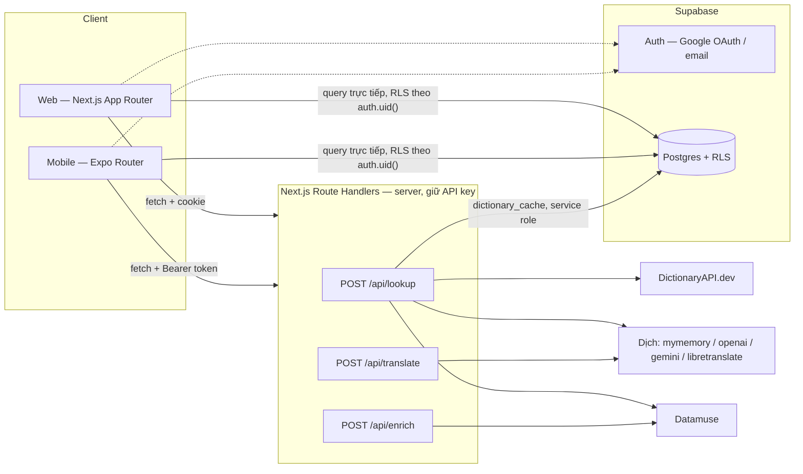

**Bất biến cần giữ:** không client nào được gọi thẳng DictionaryAPI/AI/Datamuse, và
`SUPABASE_SERVICE_ROLE_KEY` chỉ xuất hiện trong route handler.

---

## 2. Xác thực & phiên

### 2.1 Đăng nhập Google (web)

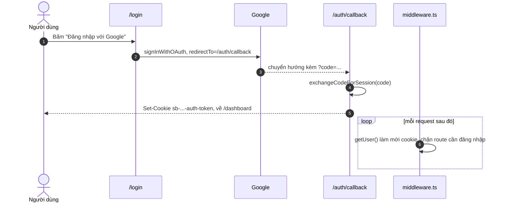

Độ dài phiên (access token 1 ngày / phiên 1 tuần) là **cấu hình Supabase**, không phải
code — xem [09 — Auth session](./09-auth-session.md).

### 2.2 Route handler nhận cả hai kiểu xác thực

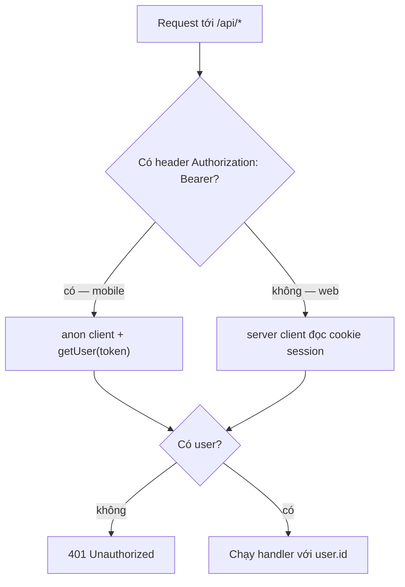

Nhờ vậy mobile **dùng lại nguyên** route handler của web, không cần backend thứ hai.

---

## 3. Tra từ → thẻ nháp → lưu thẻ

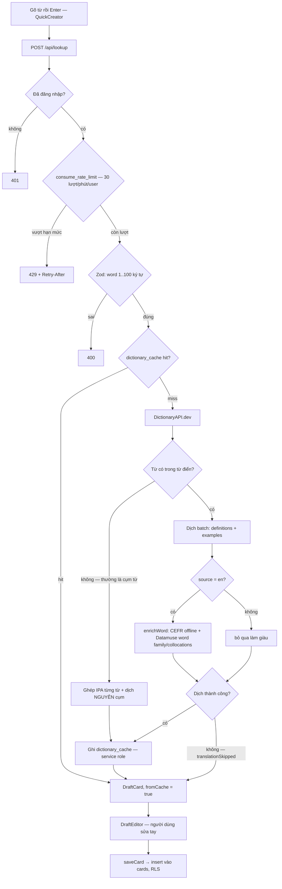

Ba quyết định đáng nhớ:

- **Không cache bản dịch hỏng.** `translationSkipped` → bỏ qua `writeCache`, lần sau tra lại.
- **Cụm từ vẫn ra thẻ dùng được:** IPA ghép ở mức từ, còn nghĩa thì dịch cả cụm
  (dịch từng từ rồi ghép là sai với collocation).
- **Làm giàu là best-effort:** Datamuse lỗi/timeout 3.5s → thẻ vẫn tạo bình thường.

---

## 4. Làm giàu thẻ cũ (backfill)

Thẻ tạo trước migration `0007` chưa có CEFR/word family/collocations. Nút "Làm giàu N thẻ"
xử lý dần theo lô, `cards.enriched_at` đánh dấu đã xong nên không chạy lại.

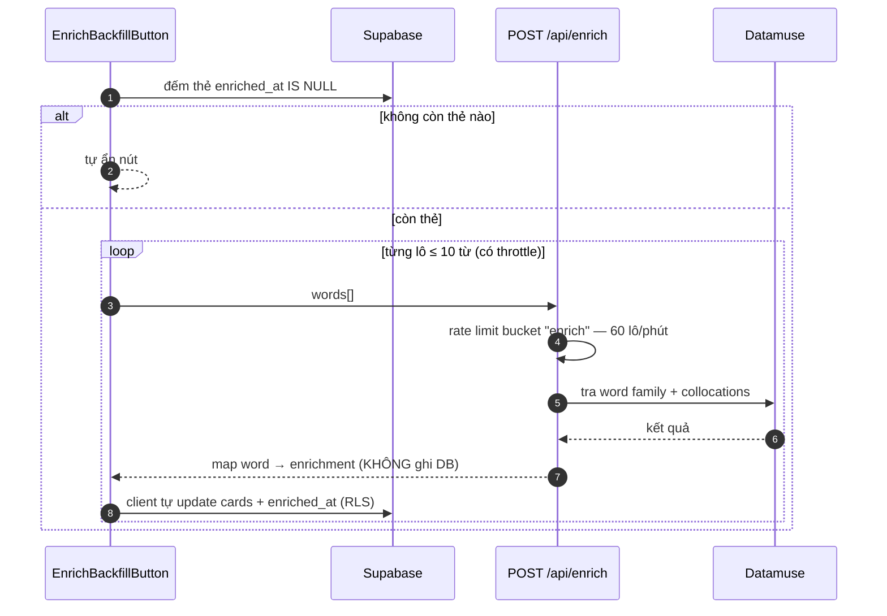

Server **không** ghi thẻ: giữ nguyên nguyên tắc "dữ liệu người dùng chỉ đi qua RLS".

---

## 5. Hàng đợi hôm nay (hạn mức từ mới)

Vấn đề đã sửa: nhập 200 từ từ Excel → trang chủ báo "200 thẻ cần ôn hôm nay". Nay hàng đợi
tách hai phần, chỉ phần **từ mới** bị giới hạn.

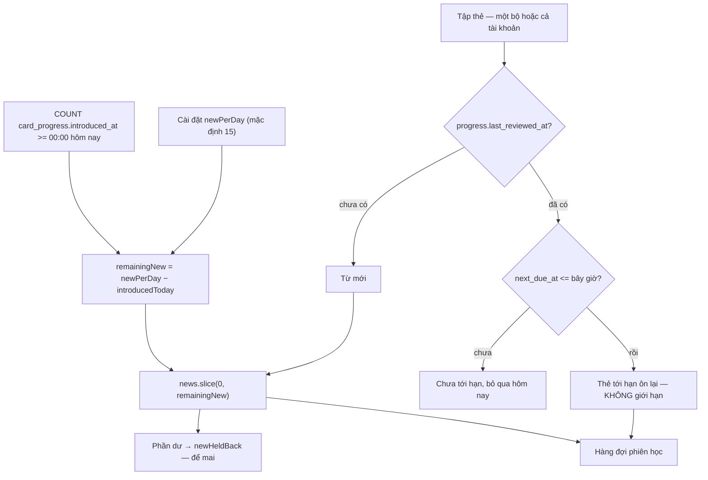

- Hạn mức là **chung cho cả tài khoản**, không cộng dồn theo từng bộ thẻ — học bộ nào
  trước thì bộ đó tiêu hạn mức.
- `dueTodayCount()` (đếm phía server, không tải dòng nào) phải cho **đúng con số** mà
  `buildDueQueue()` dựng ra — nếu lệch thì badge "N thẻ cần ôn" nói dối. Có test canh việc này.
- Reset tiến độ = xóa dòng `card_progress` → thẻ quay về "từ mới" và lại chịu hạn mức.

---

## 6. Lịch ôn SRS — máy trạng thái

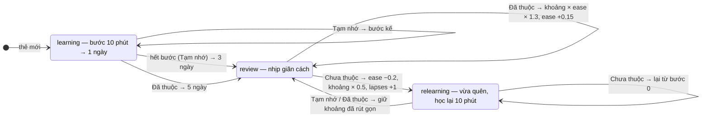

| Hằng số | Giá trị | Vì sao |
|---|---|---|
| `LEARNING_STEPS_MIN` | `[10, 1440]` | Thẻ mới không nhảy thẳng vào khoảng nhiều ngày |
| `GRADUATING_INTERVAL` / `EASY_INTERVAL` | 3 / 5 ngày | Mốc tốt nghiệp |
| ease | 1.3 – 3.0 | Chặn thẻ khó bị hẹn quá xa / thẻ dễ dồn quá dày |
| `FUZZ_RATIO` | ±5% (từ 4 ngày trở lên) | Cả lô nhập cùng lúc không tới hạn cùng một ngày mãi mãi |
| `MAX_INTERVAL_DAYS` | 365 | Hẹn xa hơn 1 năm là vô nghĩa |
| `LEECH_LAPSES` | 6 lần quên | Nên sửa thẻ thay vì ôn tiếp |

**Khoảng ôn được lưu tường minh** ở `interval_days`, không suy ra từ
`next_due_at − last_reviewed_at` như bản trước `0009` — nhờ vậy ôn sớm hay muộn vài ngày
cũng không làm lệch lịch. `stateFromRow()` vẫn đọc được dữ liệu cũ (thiếu cột → coi như
đã tốt nghiệp).

---

## 7. Phiên học + hoàn tác

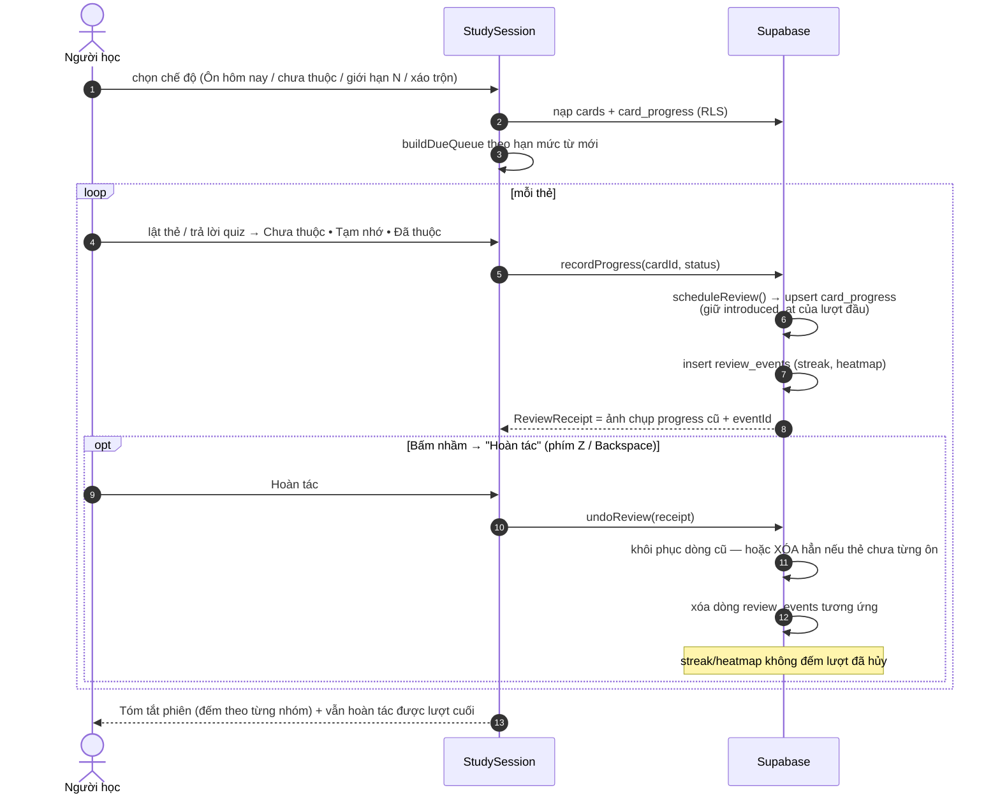

Thao tác lật: chạm, **kéo/vuốt ngang** (góc xoay bám theo con trỏ hoặc ngón tay, thả tay ra mới
quyết định lật hẳn hay bật về) hoặc phím Space. Phần quyết định là hàm thuần ở
[flip.ts](../src/lib/flip.ts), nhân bản sang mobile và có test canh không trôi.

Hai chỗ chịu lỗi có chủ đích: `review_events` ghi hỏng thì **không chặn** phiên học
(chỉ mất khả năng hoàn tác lượt đó); migration `0009` chưa chạy thì `recordProgress`
tự ghi lại bằng bộ cột cũ thay vì để người học đứng giữa chừng.

---

## 8. Xóa & thùng rác 30 ngày

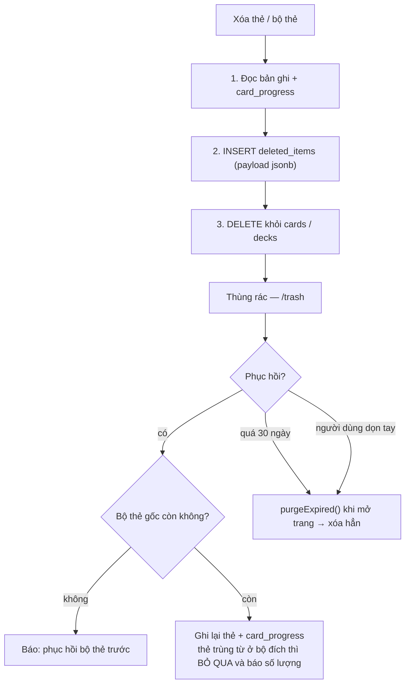

**Lưu trữ trước, xóa sau** — lỗi giữa đường chỉ để lại một bản lưu trữ dư (thẻ gốc còn),
không mất dữ liệu. Và chọn *bảng lưu trữ riêng* thay vì cột `deleted_at`: cách sau bắt
phải sửa **mọi** truy vấn ở cả hai client (phiên học, thống kê, export, chống trùng từ) —
sót một chỗ là thẻ đã xóa lọt vào bài học.

> Mobile hiện chỉ **xóa vào** thùng rác; xem/phục hồi vẫn phải lên web.

---

## 9. Cài đặt theo tài khoản

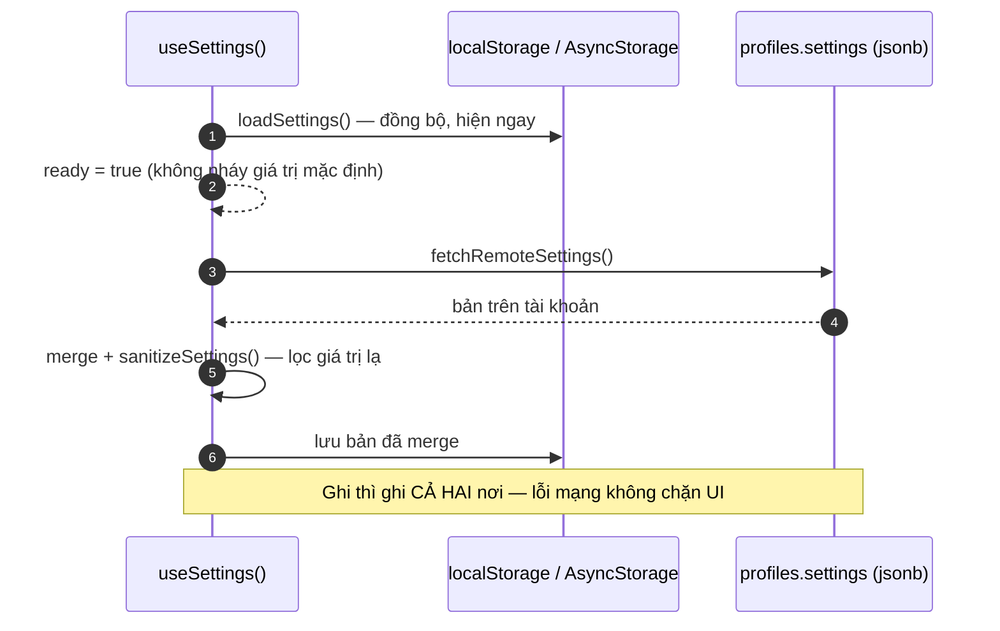

`ready` bật ngay sau bước localStorage vì bước remote **có thể không bao giờ về** (offline).
Theme cố ý **không** đồng bộ — máy khác nhau, nhu cầu sáng/tối khác nhau.

---

## 10. Dữ liệu → màn Tiến độ

`/progress` nạp **một lần** rồi chia dữ liệu cho bốn khối, thay vì mỗi khối tự query.

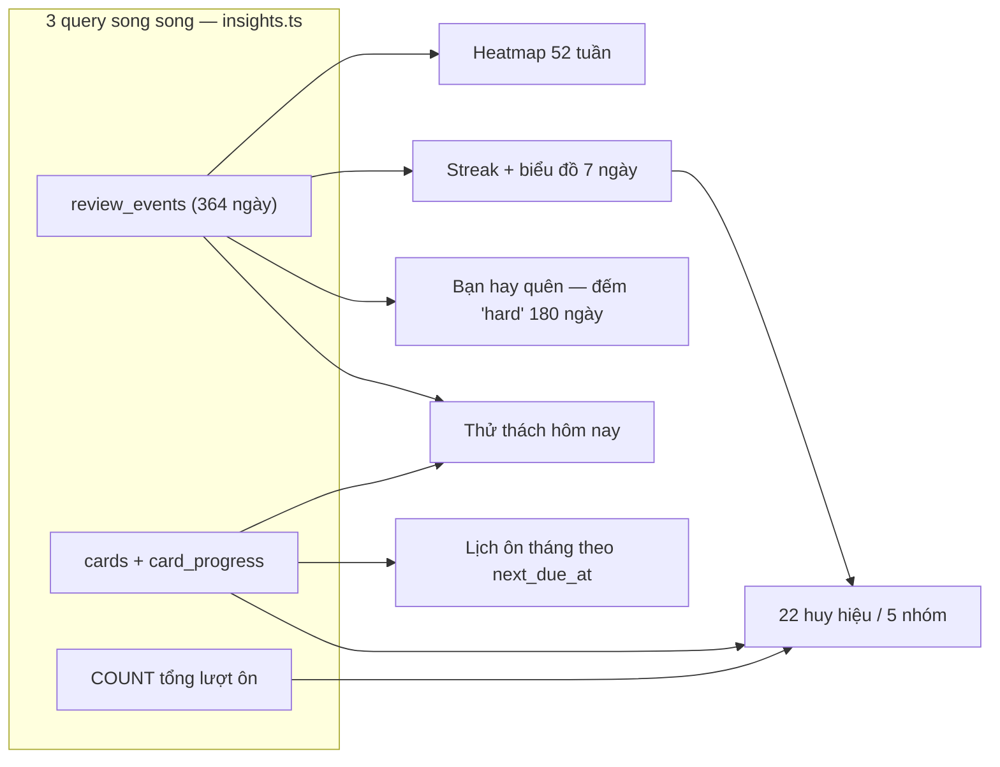

Thử thách hôm nay sinh **tất định theo ngày** (không random, không bảng mới) nên web và
mobile hiện đúng cùng bộ nhiệm vụ. Heatmap/chuỗi dài nhất tính trong cửa sổ **364 ngày**;
riêng tổng lượt ôn đếm toàn bộ phía server.

---

## 11. Mô hình dữ liệu

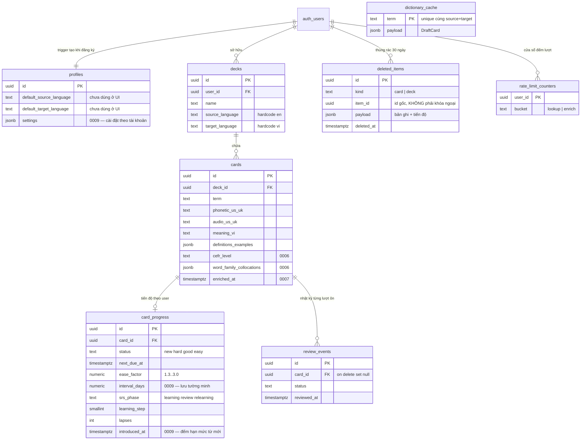

`dictionary_cache` **dùng chung cho mọi user** (ghi bằng service role, không gắn `user_id`)
— một người tra "resilient" thì người sau khỏi tốn lượt gọi AI. Mọi bảng còn lại bật RLS
theo `auth.uid()`.
